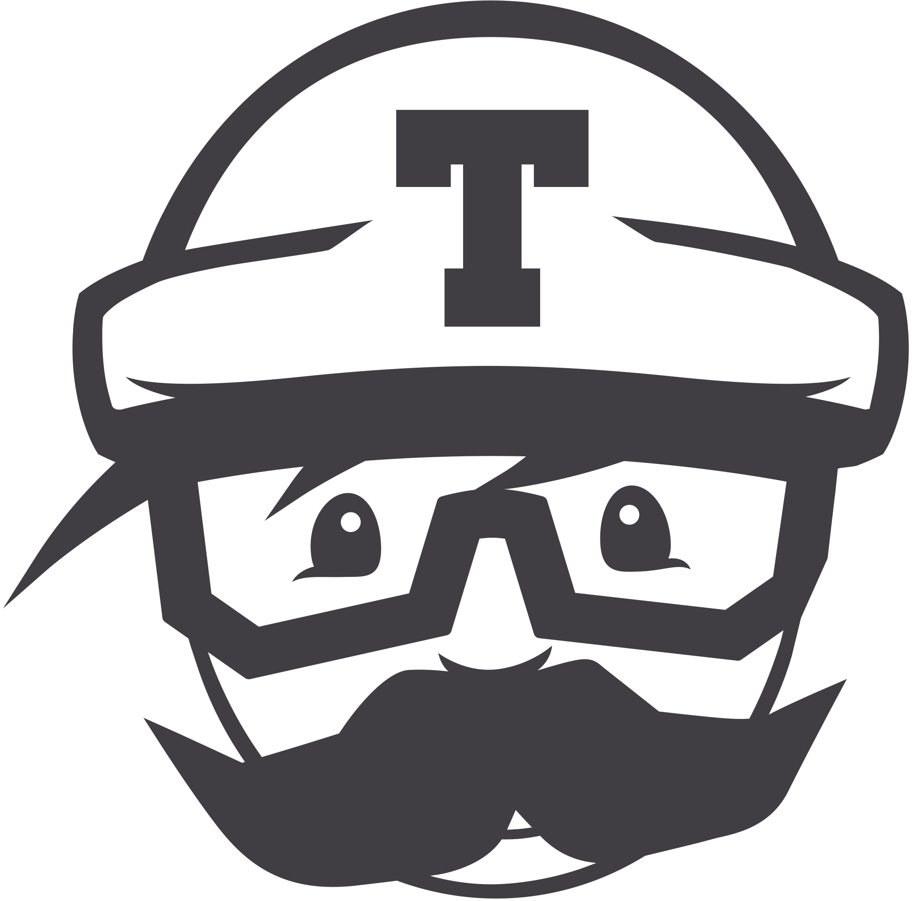

# Introduction

<h2 align="center">The MES College Alumni Association &#174;</h2>

---

Greetings and welcome to the documentation site for [mesalumniassociation.com](https://mesalumniassociation.com).

Before diving deep into technical details, please read further to understand the objectives and goals of the project from an operational and a technology standpoint.

## **Goals**

1. Keep the operational costs low
2. Continuous Documentation

### **Keeping the costs low**

The primary consideration while determining the current website/API architecture was the overall cost. Most pages on the website built for the initial launch are static. The registration/post-registration pages are few exceptions since they connect to a data store. As a result, the website, the database and the backend API are all deployed on a basic virtual private server (VPS) with 1GB of RAM and a 25GB SSD disk. The VPS owned by **DigitalOcean** resides in their BLR data centre. The association has been made aware that as the scope of the website increases, the infrastructure will need to be scaled up.

The website uses other external services for CI/CD, emails and serving images.

- For CI/CD, the project uses the free tier of **Travis CI**
- Images are served from the free tier of **ImageKit**
- For emails, the project is using the _Essentials 40K paln_ from **SendGrid**
- **Github** is the repository for the source code

At the moment, the free tier's will suffice. However, if at any time, the scope of the project is deemed to go beyond the allowed limit of any of the free tier's, it needs to be brought to the attention of the association so that an appropriate decision can be taken.

### **Continuous Documentation**

Presently, the association does not have a dedicated technical team for this project. All technical tasks (including this documentation) have been carried out by an ex-alumni. Until there is a dedicated team, upcoming work will most likely be assigned to other interested alumni or freelancers.

It is therefore imperative that any new or changing features are accurately documented so that there is a smooth handover to new project personnel.

## **Technology Stack**

### **Frontend**

&nbsp;&nbsp;&nbsp;&nbsp;&nbsp;&nbsp;&nbsp;&nbsp;&nbsp;

### **Backend**

&nbsp;&nbsp;&nbsp;

### **Datastore**

### **Other Tools and Services**

&nbsp;&nbsp;&nbsp;&nbsp;&nbsp;&nbsp;&nbsp;&nbsp;&nbsp;&nbsp;&nbsp;&nbsp;&nbsp;&nbsp;&nbsp;
